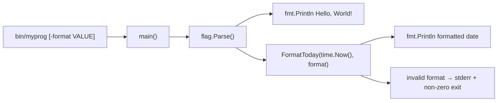

# 000-Myprog-DisplayTodayDate

## 背景 (Background)

`features/myprog` は現状、起動時に固定メッセージ `Hello, World!` のみを標準出力へ表示する最小構成の CLI である。

日付を確認する用途で myprog を使いたいという要望があり、実行時点の「今日の日付」を表示する機能を追加する。用途によって日付の見た目を変えたい場合があるため、フラグで表示形式を切り替えられるようにする。

## 要件 (Requirements)

### 必須要件

1. `bin/myprog` を引数なしで実行したとき、標準出力に実行日（ローカルタイムゾーンにおける「今日」）の日付を表示する。
2. 引数なし（または形式未指定）のときの日付表示形式は ISO 8601 の日付形式 `YYYY-MM-DD` とする（例: `2026-09-04`）。
3. 既存の `Hello, World!` 出力は維持する。日付はそれとは別行で出力する。
4. 出力順は次のとおりとする。
   1. `Hello, World!`
   2. 今日の日付（選択中の形式）
5. 引数なしでも日付が表示される（デフォルト形式）。形式の切替には CLI フラグを用いる。
6. 日付フォーマットをフラグで切り替えられること。
   - フラグ名: `-format`
   - 受け付ける値と出力例（基準日 `2026-09-04`）:

     | 値 | 出力例 | 備考 |
     | :--- | :--- | :--- |
     | `iso`（デフォルト） | `2026-09-04` | `YYYY-MM-DD` |
     | `slash` | `2026/09/04` | `YYYY/MM/DD` |
     | `jp` | `2026年09月04日` | 日本語表記 |

   - 未指定時は `iso` と同等とする。
   - 未対応の値を渡した場合は、標準エラーに簡潔なエラー（または usage）を出し、終了コードは非 `0` とする。

### 任意要件

1. 時刻（時分秒）の表示（本仕様のスコープ外）。

### 非要件

1. タイムゾーンの明示指定や UTC 固定は行わない（OS のローカルタイムゾーンに従う）。
2. GUI や Web API の提供は対象外とする。
3. 任意の Go layout 文字列をそのまま受け付ける自由形式フォーマットは対象外とする（上記の名前付き値のみ）。

## 実現方針 (Implementation Approach)

### 配置

- 対象モジュール: `features/myprog`
- エントリポイント: 既存の `features/myprog/main.go` を拡張する
- 日付取得・整形ロジックは `main` から呼び出し可能な、テストしやすい関数として切り出す（例: 同一パッケージ内の `FormatToday(t time.Time, format string) (string, error)`、または `internal/date` への配置）
- CLI フラグの定義・パースは標準ライブラリ `flag` を用いる

### 技術選択

- Go 標準ライブラリ `time` を使用する（`time.Now()` で現在時刻を取得し、選択された形式に応じて整形する）
- Go 標準ライブラリ `flag` で `-format` を定義する
- 外部依存パッケージは追加しない（KISS / YAGNI）
- ディレクトリを `cmd/` + `internal/` へ大規模再編することは本仕様では行わない。必要になった時点で別仕様とする

### 処理フロー



### 設計上の決定

| 項目 | 決定 |
| :--- | :--- |
| 日付ソース | `time.Now()`（ローカル TZ） |
| デフォルト表示形式 | `iso`（`YYYY-MM-DD`） |
| 形式切替 | `-format`（`iso` / `slash` / `jp`） |
| 既存メッセージ | 維持（先頭行） |
| 不正な `-format` | stderr + 非 0 終了 |

## 検証シナリオ (Verification Scenarios)

1. リポジトリルートで `scripts/process/build.sh` を実行し、`bin/myprog` が生成されることを確認する。
2. `bin/myprog` を引数なしで実行する。
3. 標準出力の 1 行目が `Hello, World!` であること。
4. 標準出力の 2 行目が、実行日のローカル日付を `YYYY-MM-DD` で表した文字列であること（例: 実行日が 2026-09-04 なら `2026-09-04`）。
5. 標準エラー出力にエラーが出ておらず、終了コードが `0` であること。
6. `bin/myprog -format iso` を実行し、引数なしと同じ日付形式（`YYYY-MM-DD`）になること。
7. `bin/myprog -format slash` を実行し、2 行目が `YYYY/MM/DD`（例: `2026/09/04`）になること。
8. `bin/myprog -format jp` を実行し、2 行目が `YYYY年MM月DD日`（例: `2026年09月04日`）になること。
9. `bin/myprog -format unknown` を実行し、終了コードが非 `0` で、標準エラーにエラー内容が出力されること。
10. 日付が変わったあとに再度実行すると、2 行目の日付が新しい日付に更新されること（手動確認のイメージ。自動化では固定時刻注入で代替する）。

## テスト項目 (Testing for the Requirements)

### 要件と検証の対応

| 要件 | 検証方法 |
| :--- | :--- |
| デフォルトで日付が `YYYY-MM-DD` で出力される | 単体テスト: 固定の `time.Time` と `iso`（または空）を渡し、整形結果を検証 |
| `-format slash` / `jp` で形式が切り替わる | 単体テスト: 各 format 値の整形結果を検証 |
| 不正な `-format` でエラーになる | 単体テスト: エラー戻り値（またはエラー文字列）を検証 / 統合テスト: 終了コード非 0 |
| 起動時に日付が表示される | 統合テスト: `bin/myprog` を実行し、stdout 2 行目が当日日付パターンに一致することを検証 |
| フラグ付き起動で形式が変わる | 統合テスト: `-format slash` / `-format jp` の stdout を検証 |
| `Hello, World!` が維持される | 統合テスト: stdout 1 行目が `Hello, World!` であることを検証 |
| 正常時の終了コード 0 | 統合テスト: プロセス終了コードを検証 |

### ビルド・全体検証

1. ビルド＋単体テスト:

   ```
   scripts/process/build.sh
   ```

   - `features/myprog` 配下に追加する日付整形・format 解釈ロジックの単体テストがここに含まれること。

2. myprog 日付表示の統合テスト:

   ```
   scripts/process/integration_test.sh --specify "MyprogTodayDate|DisplayToday"
   ```

   - `tests/` 配下に myprog 向け統合テストを新設する（現状 `tests/` が未整備の場合は、本機能実装時に最小構成で用意する）。
   - バイナリ実行結果の stdout / stderr / exit code を検証する（引数なし・各 `-format`・不正値）。
   - 影響範囲が myprog CLI のみのため、GUI / llm 等の他カテゴリは実行対象に含めない。

### 単体テストの指針

- 日付整形関数は `time.Time` と format 名を引数に取り、`time.Now()` を関数内部で直接呼ばない（またはテストで差し替え可能にする）。
- 代表ケース例:
  - `2026-09-04 15:30:00` + `iso` → `"2026-09-04"`
  - `2026-09-04 15:30:00` + `slash` → `"2026/09/04"`
  - `2026-09-04 15:30:00` + `jp` → `"2026年09月04日"`
  - 未知の format → エラー
  - 年始・月末など境界日（任意で追加）
