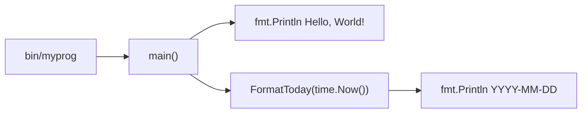

# 000-Myprog-DisplayTodayDate

## 背景 (Background)

`features/myprog` は現状、起動時に固定メッセージ `Hello, World!` のみを標準出力へ表示する最小構成の CLI である。

日付を確認する用途で myprog を使いたいという要望があり、実行時点の「今日の日付」を表示する機能を追加する。

## 要件 (Requirements)

### 必須要件

1. `bin/myprog` を引数なしで実行したとき、標準出力に実行日（ローカルタイムゾーンにおける「今日」）の日付を表示する。
2. 日付の表示形式は ISO 8601 の日付形式 `YYYY-MM-DD` とする（例: `2026-09-04`）。
3. 既存の `Hello, World!` 出力は維持する。日付はそれとは別行で出力する。
4. 出力順は次のとおりとする。
   1. `Hello, World!`
   2. 今日の日付（`YYYY-MM-DD`）
5. 本機能は追加の CLI フラグや位置引数を必要としない（起動するだけで日付が表示される）。

### 任意要件

1. 日付フォーマットをフラグで切り替えられるようにする（本仕様のスコープ外。必要になったら別仕様で扱う）。
2. 時刻（時分秒）の表示（本仕様のスコープ外）。

### 非要件

1. タイムゾーンの明示指定や UTC 固定は行わない（OS のローカルタイムゾーンに従う）。
2. GUI や Web API の提供は対象外とする。

## 実現方針 (Implementation Approach)

### 配置

- 対象モジュール: `features/myprog`
- エントリポイント: 既存の `features/myprog/main.go` を拡張する
- 日付取得・整形ロジックは `main` から呼び出し可能な、テストしやすい関数として切り出す（例: 同一パッケージ内の `FormatToday(t time.Time) string`、または `internal/date` への配置）

### 技術選択

- Go 標準ライブラリ `time` を使用する（`time.Now()` で現在時刻を取得し、`Format("2006-01-02")` で整形する）
- 外部依存パッケージは追加しない（KISS / YAGNI）
- ディレクトリを `cmd/` + `internal/` へ大規模再編することは本仕様では行わない。必要になった時点で別仕様とする

### 処理フロー



### 設計上の決定

| 項目 | 決定 |
| :--- | :--- |
| 日付ソース | `time.Now()`（ローカル TZ） |
| 表示形式 | `YYYY-MM-DD` |
| 既存メッセージ | 維持（先頭行） |
| CLI 引数 | なし |

## 検証シナリオ (Verification Scenarios)

1. リポジトリルートで `scripts/process/build.sh` を実行し、`bin/myprog` が生成されることを確認する。
2. `bin/myprog` を引数なしで実行する。
3. 標準出力の 1 行目が `Hello, World!` であること。
4. 標準出力の 2 行目が、実行日のローカル日付を `YYYY-MM-DD` で表した文字列であること（例: 実行日が 2026-09-04 なら `2026-09-04`）。
5. 標準エラー出力にエラーが出ておらず、終了コードが `0` であること。
6. 日付が変わったあとに再度実行すると、2 行目の日付が新しい日付に更新されること（手動確認のイメージ。自動化では固定時刻注入で代替する）。

## テスト項目 (Testing for the Requirements)

### 要件と検証の対応

| 要件 | 検証方法 |
| :--- | :--- |
| 日付が `YYYY-MM-DD` で出力される | 単体テスト: 固定の `time.Time` を渡し、整形結果を検証 |
| 起動時に日付が表示される | 統合テスト: `bin/myprog` を実行し、stdout 2 行目が当日日付パターンに一致することを検証 |
| `Hello, World!` が維持される | 統合テスト: stdout 1 行目が `Hello, World!` であることを検証 |
| 終了コード 0 | 統合テスト: プロセス終了コードを検証 |

### ビルド・全体検証

1. ビルド＋単体テスト:

   ```
   scripts/process/build.sh
   ```

   - `features/myprog` 配下に追加する日付整形ロジックの単体テストがここに含まれること。

2. myprog 日付表示の統合テスト:

   ```
   scripts/process/integration_test.sh --specify "MyprogTodayDate|DisplayToday"
   ```

   - `tests/` 配下に myprog 向け統合テストを新設する（現状 `tests/` が未整備の場合は、本機能実装時に最小構成で用意する）。
   - バイナリ実行結果の stdout / exit code を検証する。
   - 影響範囲が myprog CLI のみのため、GUI / llm 等の他カテゴリは実行対象に含めない。

### 単体テストの指針

- 日付整形関数は `time.Time` を引数に取り、`time.Now()` を関数内部で直接呼ばない（またはテストで差し替え可能にする）。
- 代表ケース例:
  - `2026-09-04 15:30:00` → `"2026-09-04"`
  - 年始・月末など境界日（任意で追加）
