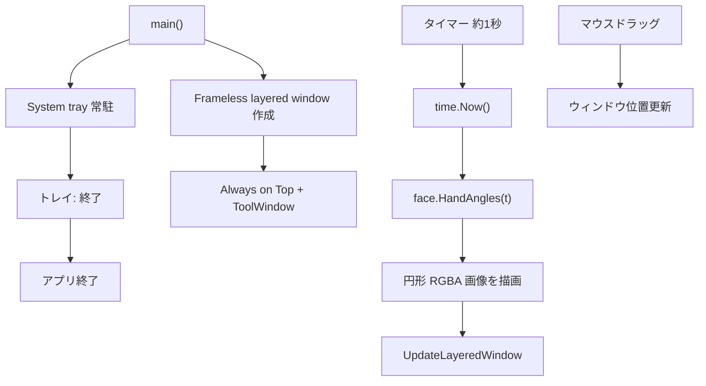

# 001-Clock-DesktopAnalog

## 背景 (Background)

デスクトップ上で時刻を一目で確認できる、軽量な「時計アクセサリ」が欲しい。
既存の `features/myprog` は CLI であり GUI を持たないため、本機能は独立した新 feature として追加する。

対象環境は Windows デスクトップとし、丸いアナログ時計・透過・最前面・トレイ常駐といったアクセサリらしい挙動を MVP の範囲とする。

## 要件 (Requirements)

### 必須要件

1. 新 feature `features/clock` を追加し、Windows 向けデスクトップアプリとして動作するバイナリ `bin/clock.exe`（または `bin/clock` + `GOEXE`）を提供する。
2. 起動すると、**丸いアナログ時計**（時針・分針・秒針）を表示する。
3. 時計の周囲（円の外側）は**透過**し、背面のデスクトップや他ウィンドウが見えること。
4. ウィンドウは**常に最前面**（Always on Top）であること。
5. 時計表示領域を**ドラッグ**して画面上の任意位置へ移動できること。
6. **タスクバーには表示しない**こと（ツールウィンドウ／所有者ウィンドウ等の適切なスタイルで除外する）。
7. **システムトレイに常駐**すること。トレイアイコンから少なくとも「終了」操作ができること。
8. 時刻はローカルタイムゾーンの現在時刻に従い、**秒針が少なくとも 1 秒間隔で更新**されること（より高頻度の更新は任意）。
9. `features/myprog` とは独立したモジュールとし、相互依存しないこと。

### 任意要件

1. 文字盤の目盛り・数字の装飾。
2. ウィンドウ位置の永続化（再起動後に前回位置を復元）。
3. 起動時の Windows ログオン自動起動。
4. 時計サイズや文字盤テーマの設定 UI。

### 非要件

1. macOS / Linux 対応（本仕様の対象外。ビルドやテストは Windows を前提とする）。
2. アラーム、タイマー、世界時計。
3. ネットワーク時刻同期（NTP）の独自実装（OS の時刻に従う）。
4. `myprog` からの起動・連携。

## 実現方針 (Implementation Approach)

### 配置

```
features/clock/
  go.mod
  main.go                 # エントリポイント
  internal/face/          # 針角度計算・文字盤描画（テスト容易な純ロジック）
  internal/winui/         # Windows ウィンドウ / トレイ / ドラッグ（OS 依存）
```

- モジュールパス例: `github.com/axsh/tokotachi/features/clock`（既存 `myprog` に合わせる）
- 成果物: `scripts/process/build.sh` 経由で `bin/clock.exe` を生成（既存 Go feature のビルド規約に従う）

### 技術選択

| 項目 | 決定 | 理由 |
| :--- | :--- | :--- |
| 言語 | Go | ユーザー指定。既存 `features/` と整合 |
| GUI フレームワーク | **大規模 GUI フレームワークは採用しない** | 円形・ピクセル透過・非タスクバー・トレイが要件の中心であり、Fyne 等では透過ウィンドウが弱い |
| ウィンドウ | Win32 **layered window**（`WS_EX_LAYERED` + `UpdateLayeredWindow` 等） | 円形の外側を alpha=0 にして真の透過を実現しやすい |
| 描画 | Go の `image` / 自前のアナログ文字盤レンダラ | 針角度計算を純関数化し単体テスト可能 |
| トレイ | 軽量な Go トレイライブラリ（例: `github.com/getlantern/systray` または同等） | トレイ常駐と終了メニューを短く実装できる |
| 最前面 | `HWND_TOPMOST` / 相当の拡張スタイル | 必須要件を直接満たす |
| タスクバー非表示 | `WS_EX_TOOLWINDOW` 等 | タスクバーボタンを出さない |
| 外部依存 | 必要最小限のみ | KISS / YAGNI。Wails（WebView2）はビルド手順が `go build` と乖離するため本 MVP では採用しない |

### 処理フロー



### 設計上の決定

| 項目 | 決定 |
| :--- | :--- |
| 時計形状 | 正円。外側ピクセルは完全透過 |
| 針 | 時・分・秒の 3 本 |
| 更新間隔 | 最低 1 秒（秒針の進行が目視できること） |
| 時刻ソース | `time.Now()`（ローカル TZ） |
| 終了方法 | トレイメニューの「終了」（ウィンドウの × は持たない想定） |
| 他 feature との関係 | 完全独立 |

### テスト容易性

- 針の角度計算（`HandAngles`）と、与えた時刻に対する描画結果の性質（四隅が透明、中心付近が不透明など）は OS UI から切り離して単体テストする。
- Win32 呼び出しは薄いアダプタに閉じ込め、可能ならインターフェースで差し替え可能にする（必須ではないが推奨）。

## 検証シナリオ (Verification Scenarios)

1. Windows 上で `scripts/process/build.sh` を実行し、`bin/clock.exe` が生成されることを確認する。
2. `bin/clock.exe` を起動する。
3. デスクトップ上に丸いアナログ時計が表示され、円の外側から背面のデスクトップが見える（透過している）こと。
4. 秒針（および必要に応じて分針・時針）が現在時刻に応じて動くこと。
5. 他のウィンドウを前面にしても、時計が最前面に残り続けること。
6. 時計をドラッグし、画面上の別位置へ移動できること。
7. タスクバーに `clock` のボタンが出ないこと。
8. 通知領域（システムトレイ）にアイコンが表示されること。
9. トレイアイコンのメニューから「終了」を選び、プロセスが終了し時計が消えること。
10. （回帰）`features/myprog` のビルドと既存挙動に影響がないこと。

## テスト項目 (Testing for the Requirements)

### 要件と検証の対応

| 要件 | 検証方法 |
| :--- | :--- |
| アナログ針が時刻に対応する | 単体テスト: 既知の `time.Time` に対する時・分・秒の角度（またはラジアン）を検証 |
| 円の外側が透過 | 単体テスト: 描画した `*image.RGBA` の四隅 alpha が 0、中心付近 alpha が非 0 |
| 秒単位で更新される描画入力 | 単体テスト: 1 秒進めた時刻で秒角が変わること |
| バイナリがビルドできる | `scripts/process/build.sh` |
| myprog と独立 | `features/clock` が独自 `go.mod` を持ち、myprog を import しないこと（コードレビュー / `go list` 等） |
| ウィンドウ最前面・ドラッグ・トレイ・非タスクバー | 検証シナリオ（手動）＋可能なら Windows 限定の統合スモーク（起動→トレイ終了相当のシグナルで終了） |

GUI の「見た目・最前面・ドラッグ」はヘッドレス自動化が難しいため、**ロジックと描画の自動テストを必須**とし、ウィンドウ挙動は検証シナリオで担保する。統合テストを追加する場合は Windows での起動・終了スモークに限定する。

### ビルド・全体検証

1. ビルド＋単体テスト:

   ```
   scripts/process/build.sh
   ```

   - `features/clock` 配下の針角度・描画に関する単体テストがここに含まれること。
   - 既存 `features/myprog` のテストも同時に実行され、失敗しないこと。

2. clock 向け統合テスト（追加する場合）:

   ```
   scripts/process/integration_test.sh --specify "Clock|DesktopAnalog"
   ```

   - 影響範囲は新規 `features/clock` のみのため、`gui` / `llm` 等の他カテゴリは実行対象に含めない。
   - GUI 操作のフル E2E は本仕様の必須とはしない。追加する場合は「バイナリ起動後に正常終了できる」レベルのスモークに留める。

### 単体テストの指針

- `HandAngles(t time.Time)` のような純関数を用意し、`time.Now()` を内部で直接呼ばない。
- 代表ケース例（12 時間制の針位置）:
  - `2026-09-18 00:00:00` → 時針・分針・秒針がいずれも 12 時方向（角度 0 または実装で定義した基準）
  - `2026-09-18 06:00:00` → 時針が 6 時方向
  - `2026-09-18 00:00:30` → 秒針が 6 時方向
  - `2026-09-18 00:30:00` → 分針が 6 時方向、時針が 12 時と 1 時の中間付近
- 描画テスト: 固定サイズ（例: 200x200）でレンダし、四隅透明・円内不透明をサンプル点で検証する。
