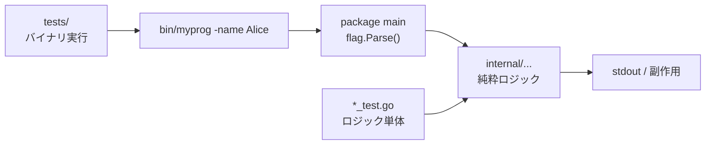

# 調査レポート: myprog の main 関数への引数追加

## 1. 調査概要 (Investigation Summary)

### 目的
`features/myprog` の `main` 関数に新しい引数を追加するには、何をどう変えればよいかを把握する。

### スコープ
- [features/myprog/main.go](file://features/myprog/main.go) / [features/myprog/go.mod](file://features/myprog/go.mod)
- 機能ディレクトリ規約 ([features/README.md](file://features/README.md))
- ビルド・テストパイプライン ([scripts/process/build.sh](file://scripts/process/build.sh), [scripts/process/integration_test.sh](file://scripts/process/integration_test.sh))
- 開発プロセス・計画規約 (`project-instructions`, `planning-rules`, `coding-rules`)

### 背景
現状の myprog は Hello World のみ。CLI 引数の実装・テスト・仕様は未整備。

---

## 2. 調査手法 (Methodology)

- ソース閲覧 (`main.go`, `go.mod`)
- リポジトリ横断検索 (`myprog`, `flag` / `os.Args` / CLI 関連)
- ビルドスクリプトの Go 機能処理の読解
- 機能規約・phases・テスト方針の確認
- Go ツールチェーンの有無確認 (`go version go1.24.0`)

---

## 3. 調査結果 (Findings)

### 3.1 現状の myprog

```1:7:features/myprog/main.go
package main

import "fmt"

func main() {
	fmt.Println("Hello, World!")
}
```

- モジュール: `github.com/axsh/tokotachi/features/myprog` (Go 1.24.0)
- 依存なし、テストなし、`cmd/` / `internal/` なし
- ファイル構成はルート直下の `main.go` + `go.mod` のみ

### 3.2 Go 言語上の制約（最重要）

**Go の `main` は引数も戻り値も持てない。** シグネチャは常に `func main()`。

したがって「`func main(name string)` のように引数を足す」はコンパイルエラーになる。  
コマンドライン引数は次のいずれかで取る:

| 方式 | 特徴 | 本プロジェクトでの適合 |
|------|------|------------------------|
| `os.Args` | 生の引数スライス | 単純な位置引数向き |
| 標準庫 `flag` | `-name` 形式のフラグ | 依存追加なし、KISS に合う |
| cobra 等 | サブコマンド対応 | 現状未使用。YAGNI なら過剰になりやすい |

### 3.3 ディレクトリ規約との差

[features/README.md](file://features/README.md) が示す想定:

```
features/<feature-name>/
  cmd/           # CLI entry points
  internal/      # Internal packages
  go.mod
```

現状 myprog は `main.go` をルートに置いており、規約の `cmd/` 構成とは一致していない。  
引数処理を本格化するなら、パース・ビジネスロジックを `internal/` に切り出し、`main` は薄いエントリにすることが自然。

### 3.4 ビルド・テストへの影響

**単体ビルド** ([scripts/process/build.sh](file://scripts/process/build.sh)):

- `features/*/go.mod` を持つディレクトリを列挙
- `go list ./...` から `tests/` を除いて `go test`
- `go build -o bin/<feature_name> ./...` → `bin/myprog` を生成

**統合テスト** ([scripts/process/integration_test.sh](file://scripts/process/integration_test.sh)):

- ルートの `tests/go.mod` が必要
- 現状 `tests/` は存在しない（未設定時は警告して exit 0）

**計画規約** (planning-rules):

- CLI として利用者に提供される機能は **統合テスト必須**

### 3.5 既存の仕様・先例

- `prompts/phases/000-foundation/` に `branches/` / `refs/` はあるが、ideas / plans は未作成
- リポジトリ内に `flag` / `os.Args` / cobra 等の先行実装は見当たらない
- コーディング規約の主眼は Python/Frontend だが、TDD・KISS・YAGNI・仕様ファーストは共通

### 3.6 開発フロー上の位置づけ

このプロジェクトでは実装前に仕様が必須:

```
create-specification
  → create-implementation-plan
    → execute-implementation-plan
      → build.sh / integration_test.sh
```

調査ワークフローではコード変更不可。実装する場合は上記開発フローへ移行する。

---

## 4. 分析・考察 (Analysis)

### 「main に引数を追加」の正しい解釈

ユーザー意図は多くの場合「CLI から値を受け取れるようにする」こと。  
Go ではそれは **`main` のシグネチャ変更ではなく、`os.Args` / `flag` での読み取り** を意味する。

### 推奨アーキテクチャ（方向性のみ）



- **パースとロジックを分離**: `main` は flag 定義と呼び出しだけ。検証しやすい関数に本体を置く
- **依存は標準庫優先**: 最初の 1 引数なら `flag` で十分
- **ディレクトリ**: 小さな変更なら現状の `main.go` でも動くが、成長を見据えるなら `cmd/myprog` + `internal/` への整理を仕様で決める

### テスト観点

| 層 | 内容 | 実行手段 |
|----|------|----------|
| Unit | 引数解釈・メッセージ生成などの純粋関数 | `scripts/process/build.sh` |
| Integration | `bin/myprog` を実際に起動し、引数付き出力を検証 | `scripts/process/integration_test.sh`（要 `tests/` 整備） |

---

## 5. 推奨事項 (Recommendations)

優先度順。**本調査では実装しない。**

### P0: 要件を仕様化する

1. `/create-specification` で仕様書を作成  
   出力先の目安: `prompts/phases/000-foundation/branches/<作業ブランチ>/ideas/000-myprog-cli-args.md`
2. 仕様に含めるべき項目の例:
   - 追加する引数名（位置引数か `-flag` か）
   - 必須 / 任意、デフォルト値
   - 不正時の挙動（usage 表示、exit code）
   - 出力仕様

### P1: 実装方針を計画に落とす

1. `/create-implementation-plan` で TDD 手順を定義
2. テストを先に書く（Red → Green → Refactor）
3. CLI 提供のため統合テスト計画を必須にする

### P2: 実装時の技術選択（案）

- 第 1 候補: 標準庫 `flag`
- ロジックは `main` 外のテスト可能な関数へ
- 必要になった時点で `cmd/` + `internal/` 構成へ寄せる（YAGNI を守る）

### 次アクション

実装に進む場合は、追加したい引数の具体内容（名前・型・用途）を決めたうえで、`/create-specification` の利用を推奨する。
