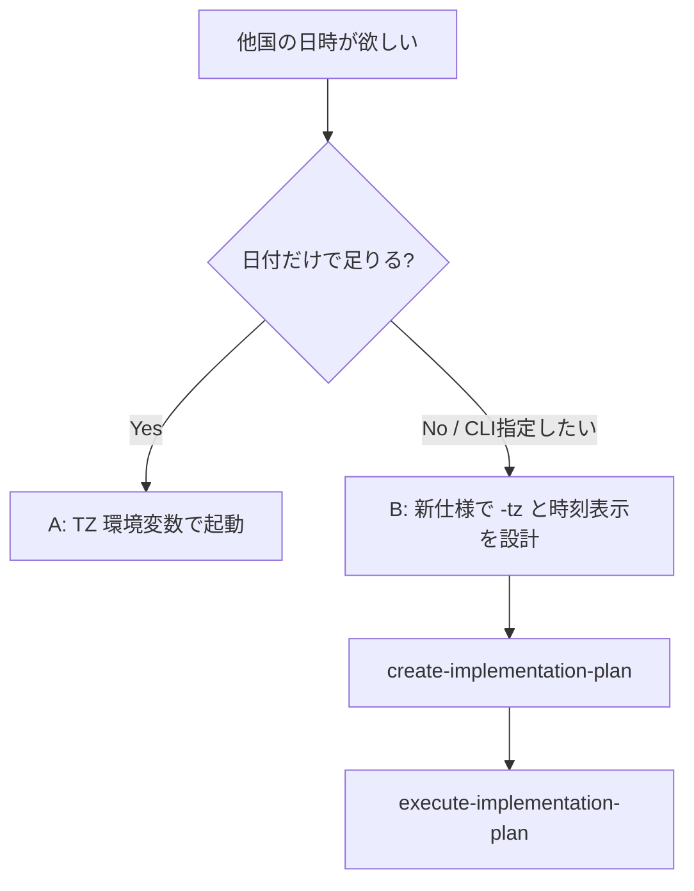

# 調査レポート: myprog 日付表示のタイムゾーン対象範囲

## 1. 調査概要 (Investigation Summary)

### 目的

今回追加した「今日の日付」表示が日本時間（JST）専用かどうか、および他国・他タイムゾーンの日付／時刻を出したい場合に何が必要かを明らかにする。

### スコープ

- 仕様: [prompts/phases/000-foundation/branches/main/ideas/000-Myprog-DisplayTodayDate.md](file://prompts/phases/000-foundation/branches/main/ideas/000-Myprog-DisplayTodayDate.md)
- 実装計画: [prompts/phases/000-foundation/branches/main/plans/000-Myprog-DisplayTodayDate.md](file://prompts/phases/000-foundation/branches/main/plans/000-Myprog-DisplayTodayDate.md)
- 実装: [features/myprog/main.go](file://features/myprog/main.go), [features/myprog/date.go](file://features/myprog/date.go)
- テスト: [features/myprog/date_test.go](file://features/myprog/date_test.go), [tests/myprog_today_date_test.go](file://tests/myprog_today_date_test.go)

### 背景

ユーザーが日付機能追加後に、「日本時間だけか／他国の時刻はどう出すか」を確認したい。

---

## 2. 調査手法 (Methodology)

- 仕様・計画の「非要件」「日付ソース」記述の確認
- `time.Now` / `Local` / `LoadLocation` / `UTC` / TZ フラグの有無を実装・テストで検索
- `FormatToday` と `main` の時刻取得経路の読み取り

検索パターン例: `timezone|time\.LoadLocation|UTC|Local|JST|Asia/Tokyo|-tz|-zone`（`features/myprog` 内）

---

## 3. 調査結果 (Findings)

### 3.1 結論（先出し）

| 質問 | 答え |
| :--- | :--- |
| 日本時間（JST）専用か？ | **いいえ**。OS のローカルタイムゾーンに従う |
| `-format jp` は JST か？ | **いいえ**。日本語の日付表記（`YYYY年MM月DD日`）であり、TZ 指定ではない |
| 他国の「日付」を今すぐ CLI で指定できるか？ | **できない**（TZ フラグ・UTC 固定は非要件で未実装） |
| 他国の「時刻」（時分秒）を出せるか？ | **現状不可**。時刻表示自体が仕様スコープ外 |

### 3.2 仕様上の位置づけ

必須要件 1:

> 標準出力に実行日（**ローカルタイムゾーン**における「今日」）の日付を表示する

非要件 1:

> **タイムゾーンの明示指定や UTC 固定は行わない**（OS のローカルタイムゾーンに従う）

任意要件:

> 時刻（時分秒）の表示（本仕様のスコープ外）

計画の Traceability でも「非要件: TZ 明示・GUI/API・自由 layout → 実装しない」と明記されている。

### 3.3 実装の挙動

`main` は `time.Now()` の結果をそのまま `FormatToday` に渡す。

```10:21:features/myprog/main.go
func main() {
	format := flag.String("format", "iso", "date format: iso, slash, or jp")
	flag.Parse()

	dateStr, err := FormatToday(time.Now(), *format)
	// ...
	fmt.Println("Hello, World!")
	fmt.Println(dateStr)
}
```

Go の `time.Now()` は **プロセスが動作しているマシンのローカル TZ**（環境変数 `TZ` や OS 設定）で「今」を返す。`Asia/Tokyo` への固定や `time.LoadLocation` 呼び出しは存在しない。

`FormatToday` は受け取った `time.Time` を layout 文字列で整形するだけで、TZ 変換はしない。

```11:25:features/myprog/date.go
func FormatToday(t time.Time, format string) (string, error) {
	// ...
	switch format {
	case "iso":
		return t.Format("2006-01-02"), nil
	case "slash":
		return t.Format("2006/01/02"), nil
	case "jp":
		return t.Format("2006年01月02日"), nil
	// ...
	}
}
```

単体テストの基準時刻も `time.Local` を使用しており、特定国 TZ への変換テストはない。

統合テストも `time.Now().Format(...)`（テスト実行環境のローカル日付）と突き合わせており、JST 固定の期待値ではない。

### 3.4 「jp」と日本時間の混同ポイント

| 項目 | 意味 |
| :--- | :--- |
| `-format jp` | 表示文字列の見た目（年・月・日の日本語表記） |
| ローカル TZ | 「今日」の暦日をどのオフセットで決めるか |

例: OS が `America/Los_Angeles` なら、`-format jp` でも **米国西海岸の「今日」** が `2026年09月03日` のように日本語表記で出る（JST の日付ではない）。

### 3.5 日付境界での影響（なぜ TZ が重要か）

日付のみ表示でも、UTC 日付変更前後では国によって「今日」が異なる。


現状フローに「任意 TZ へ変換」の段はない。

### 3.6 コードベース内の TZ 関連痕跡

`features/myprog` で `LoadLocation` / `UTC` 固定 / `-tz` フラグは **見つからなかった**。`time.Local` は単体テストの基準時刻生成のみ。

---

## 4. 分析・考察 (Analysis)

### 4.1 「日本時間だけ」ではない理由

仕様・実装とも **実行環境のローカル TZ** に委譲している。日本のマシン（または `TZ=Asia/Tokyo`）で動かせば JST の「今日」になり、他国のマシンではその国の「今日」になる。ハードコードされた日本専用ではない。

### 4.2 他国の日付／時刻を出したい場合の選択肢

#### A. コード変更なし（運用で TZ を変える）

プロセス起動前に OS / 環境変数の TZ を変えると、`time.Now()` のローカル解釈が変わる。

例（Linux/macOS / Git Bash 等）:

```bash
TZ=America/New_York ./bin/myprog
TZ=Europe/London ./bin/myprog -format slash
TZ=UTC ./bin/myprog
```

- 出せるのは依然 **日付のみ**（時分秒は非対応）
- Windows ネイティブ環境では `TZ` の効き方がランタイム依存のため、検証が必要
- 「CLI 引数で国を指定」したい要件とは別物

#### B. 機能追加する場合（要・別仕様）

現状は非要件のため、実装前に `/create-specification` が必要。方向性の例:

1. **`-tz`（または `--timezone`）フラグ**  
   - 値: IANA 名（例: `Asia/Tokyo`, `America/New_York`）  
   - 実装イメージ: `loc, err := time.LoadLocation(*tz)` → `time.Now().In(loc)` を `FormatToday` に渡す  
   - 未指定時は現行どおりローカル維持が自然

2. **時刻表示の任意要件を復活**  
   - 例: `-format` に時刻付き、または別フラグ  
   - 「他国の時刻」を求めるなら、日付だけでは不足しがち

3. **UTC 固定モード**  
   - 仕様では現時点で明示的にやらないと書かれている



### 4.3 実装上の注意（将来拡張時）

- `FormatToday` は TZ 非依存のままにし、**呼び出し側で `In(loc)` してから渡す**と単体テストしやすい（現行設計と整合）
- Windows での IANA TZ データベース（`zoneinfo`）の有無に注意（Go は埋め込みや OS 依存がある）
- 統合テストは「ローカル日付一致」前提のため、`-tz` 追加時は固定時刻＋固定 location の単体を厚くし、統合は代表 TZ を環境から独立させる設計が望ましい

---

## 5. 推奨事項 (Recommendations)

| 優先度 | 推奨 | 内容 |
| :--- | :--- | :--- |
| 高 | 現状理解の共有 | 「日本専用ではない／ローカル TZ／`jp` は表記のみ」を前提にする |
| 中 | 一時的な他国日付 | コード変更なしで `TZ=<IANA名>` 付き起動を試す（日付のみ） |
| 中 | 恒久的な CLI 指定 | 別仕様で `-tz`（と必要なら時刻表示）を追加するワークフローへ進む |
| 低 | 現状のまま | タイムゾーン明示が不要なら、非要件どおり変更しない |

**注意**: 本調査ではコード変更・仕様書変更・ビルド／テスト実行は行っていない。実装する場合は  
`/create-specification` → `/create-implementation-plan` → `/execute-implementation-plan` を推奨する。

---

## 6. 参照ファイル

| ファイル | 役割 |
| :--- | :--- |
| [ideas/000-Myprog-DisplayTodayDate.md](file://prompts/phases/000-foundation/branches/main/ideas/000-Myprog-DisplayTodayDate.md) | ローカル TZ・非要件（TZ 明示なし） |
| [plans/000-Myprog-DisplayTodayDate.md](file://prompts/phases/000-foundation/branches/main/plans/000-Myprog-DisplayTodayDate.md) | TZ は計画対象外 |
| [features/myprog/main.go](file://features/myprog/main.go) | `time.Now()` 利用 |
| [features/myprog/date.go](file://features/myprog/date.go) | 表記のみ変換 |
| [tests/myprog_today_date_test.go](file://tests/myprog_today_date_test.go) | ローカル日付との一致検証 |
